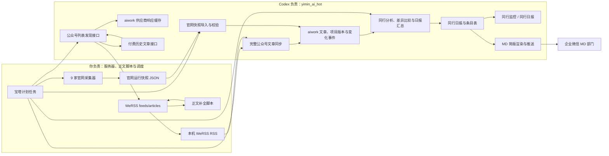
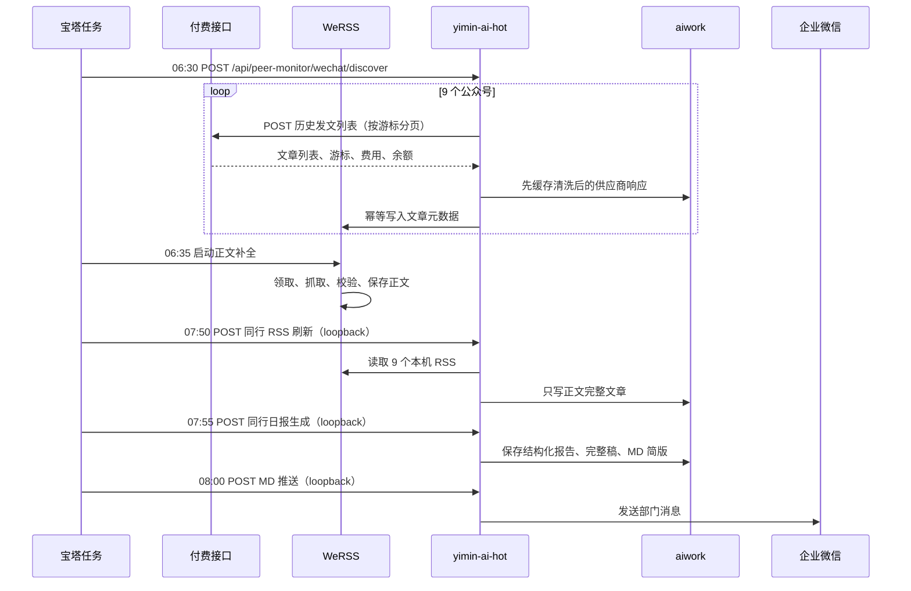

# 同行日报采集、生成与 MD 推送开发方案

## 1. 文档定位

- 业务流：同行公众号发现 → WeRSS 正文补全 → 移民日报同步 → 同行日报生成 → MD 部门企业微信推送。
- 模式：`named-flow + sync + persist`。
- 快照日期：2026-08-06（Asia/Shanghai）。
- 主仓库：`yimin-ai-hot`，Git `main`，基线 `afe1d18f827241f091505815a143728d140f1935`。
- 关联组件：WeRSS 生产服务、付费公众号历史文章接口、`aiwork` 与 `we_mp_rss` MySQL、9 家官网采集器快照。
- 本文是开发设计和实施顺序；公众号列表发现接口已在本地代码实现，尚未发布到生产。
- 本文也是双方执行边界：你负责服务器和定时任务，Codex 只修改 `yimin_ai_hot` 仓库代码；所有需要你动手或确认的事项分别标记为 **[需要你操作]**、**[需要你确认]**。

## 2. 已确认产品决策

| 主题 | 决策 |
|---|---|
| 读者 | 老板、市场部、项目部；MD 部门接收企业微信简版 |
| 发布频率 | 每日一次，08:00 发布 |
| 数据窗口 | 昨日 06:30:00 至今日 06:29:59，固定 24 小时 |
| 公众号发现 | 每日只运行一轮；一轮内允许按游标分页 |
| 正文截止 | 07:50；正文未完整的文章当天完全排除 |
| 补录 | 不补录；截止后才补全的文章以后也不进入日报 |
| 无更新日报 | 仍生成；“今日无更新同行”放在日报开头 |
| 无更新重复 | 不在后续章节再次列出 |
| 同行名称 | 内部日报使用真实名称，不使用“同行A—同行I” |
| 报告风格 | 保守，只总结同行动作，不做策略建议 |
| 轻度分析 | 允许有依据的轻度分析，必须可追溯到文章内容 |
| 政策与宣传说法 | 不承担事实核验；以“该同行发布/称/主推”的归因方式表达 |
| 内容层级 | 重要动作进入正文；普通内容进入简短附录 |
| 同题处理 | 两家及以上同行发布同一主题时合并展示并比较差异 |
| 来源链接 | 完整日报保留公众号原文或官网证据链接；MD 简版只保留内部完整日报入口 |
| 老板速览 | 完整日报不单设“老板速览” |
| 报告尾部 | 不展示四种状态图例，不输出建议清单 |
| 官网采集 | 可行；作为独立采集链路建设，后置上线，不阻塞公众号日报，最终在同行日报层与公众号动作合并 |

## 3. 范围与非目标

### 3.1 本期范围

1. 通过第三方付费接口发现 9 个同行公众号在窗口内的发文。
2. 将文章元数据幂等写入 WeRSS，并补全微信正文。
3. 仅将正文完整的文章同步到 `aiwork.yimin_peer_articles`。
4. 生成结构化同行日报、完整 Markdown/HTML 和 MD 简版。
5. 在“同行监控”下增加“同行日报”入口。
6. 08:00 将简版推送到企业微信 MD 部门。
7. 保留任务状态、费用、模型、Prompt 版本和输入哈希，支持审计与安全重跑。
8. 后续接收 9 家官网项目快照，生成新增、实质变化、不再展示和恢复展示事件，并与公众号动作统一汇总。

### 3.2 非目标

- 不验证同行文章中的政策真伪或宣传真实性。
- 不生成我方应对建议、销售话术或项目推荐。
- 不将官网采集器合并进 WeRSS。
- 不让官网采集器或其他外部脚本直接写 `aiwork`。
- 不建设另一套完整 FastAPI；宝塔通过 Shell 编排现有服务。
- 官网采集器源码与统一运行脚本放入 `yimin_ai_hot/collectors/peer-web/`，但使用独立 Python 虚拟环境和宝塔任务运行；运行输出、Chromium、日志和环境文件不进入 Git。
- 本期按一家同行一个公众号设计，不改多公众号约束。
- 不补录正文逾期文章。

### 3.3 双方执行边界

| 范围 | 你负责 | Codex 负责 |
|---|---|---|
| 生产服务器 | **[需要你操作]** SSH、宝塔、目录、Docker/Compose、网络、环境变量、脚本落盘、权限、启动/重启和日志查看 | 不直接修改生产服务器；给出接口、配置项、验收命令和错误判定标准 |
| 定时任务 | **[需要你操作]** 创建和维护宝塔计划任务，决定实际执行时间，优先调用本机接口 | 在 `yimin_ai_hot` 提供可重复调用、可查询状态、仅允许 loopback、管理员或定时任务令牌触发的接口 |
| WeRSS 与外部脚本 | **[需要你操作]** 配置 WeRSS 数据库最小权限账号，部署正文补全脚本及所需运行环境 | 在 `yimin_ai_hot` 调用付费列表接口、缓存响应并写入 WeRSS 元数据；不修改 `/opt/we-mp-rss` 或外部脚本目录 |
| 官网采集器 | **[需要你操作]** 在服务器安装独立 Python 环境、Playwright/Chromium 与 lxml，并配置宝塔任务 | 在 `yimin_ai_hot` 维护九家采集器源码、统一运行脚本、V1 快照转换、导入校验、版本历史、差异事件和日报融合 |
| `yimin_ai_hot` | 只处理文中明确标记的生产配置与发布动作 | 数据表、服务端 API、同步规则、Prompt、报告渲染、页面、MD 推送代码和测试 |
| 联调验收 | **[需要你操作]** 提供一份真实但可脱敏的接口/快照样例，在服务器执行最终调用并确认部门消息 | 提供 dry-run/导入结果，定位代码侧错误，完成仓库内修复 |

边界原则：公众号列表发现归入 `yimin_ai_hot`，通过独立的 WeRSS 数据库连接只写文章元数据；正文补全仍由 WeRSS 外部任务负责。官网采集器虽然与主项目同仓库，但不进入 Node 进程、不直接写 `aiwork`，只由宝塔独立运行并调用导入接口。无需再建设独立 FastAPI 中转服务。

## 4. 当前系统事实

### 4.1 WeRSS 生产服务

| 项目 | 当前状态 |
|---|---|
| 部署目录 | `/opt/we-mp-rss` |
| 容器 | `we-mp-rss`、`we-mp-rss-redis` |
| 镜像 | `we-mp-rss:1.5.2-amd64` |
| 服务端口 | `127.0.0.1:8001 -> 8001` |
| 自动正文开关 | `GATHER.CONTENT_AUTO_CHECK=False` |
| 已配置但未启用的表达式 | `20 3,11,19 * * *` |
| 线上 Firefox 镜像 | 不存在 |
| 部署目录版本控制 | 无 Git/SVN |
| RSS 读取路由 | `/feed/{feed_id}.{ext}`、`/rss/{feed_id}` |
| 文章管理路由 | `/api/v1/wx/articles`，需要用户或 Access Key |

部署版 `/app/apis/rss.py` 显示 RSS 路由只查询 `feeds/articles` 并生成订阅内容，不会触发外部公众号刷新。`yimin-ai-hot` 应读取：

```text
http://127.0.0.1:8001/feed/{feed_id}.xml?limit=100
```

现有生产导入脚本只支持固定 20 条人工 manifest；它提供了 dry-run、公众号预检、事务提交和提交后复核的好模式，但不能直接承担每日付费接口采集。

### 4.2 数据库职责

#### `we_mp_rss`

```text
feeds.id ──逻辑关联──> articles.mp_id
```

- `articles.id` 是唯一主键；`url` 没有唯一约束。
- `articles.mp_id`、`publish_time`、`has_content`、`status` 已有索引。
- `articles` 已具备 `content/content_html/has_content/fix_fail_count`，适合暂存不完整文章。
- `articles.mp_id` 与 `feeds.id` 没有外键，导入器必须做应用层校验。

#### `aiwork`

```text
yimin_peer_competitors
  └─ yimin_peer_sources
       └─ yimin_peer_articles
```

- `yimin_peer_sources` 唯一键：`competitor_id + source_type`。
- `yimin_peer_articles` 唯一键：`source_id + dedupe_hash`。
- `yimin_peer_articles` 查询索引：`source_id + published_at`。
- 本期每家一个 `wechat_rss`，现有来源唯一约束够用。
- `yimin_daily_reports` 与 `yimin_push_tasks` 已被普通移民日报使用，且各自存在按日期唯一约束，同行日报不能直接复用。

### 4.3 当前 9 家映射

生产配置已核对为 9 对 9，一家同行对应一个已启用公众号：

| 同行代码 | 日报真实名称 | WeRSS 公众号名 | WeRSS `feed_id` |
|---|---|---|---|
| `peer-a` | 桉侨移民 | 深圳桉侨移民 | `MP_WXS_3625711724` |
| `peer-b` | 景鸿集团（景鸿移民） | 景鸿移民服务号 | `MP_WXS_3087573428` |
| `peer-c` | 侨外出国（侨外移民） | 侨外移民 | `MP_WXS_3639875067` |
| `peer-d` | 亨瑞集团（亨瑞移民） | 亨瑞出国 | `MP_WXS_2390329593` |
| `peer-e` | 世贸通集团（世贸通移民） | 世贸通移民 | `MP_WXS_2395537072` |
| `peer-f` | 澳星集团（澳星出国） | 澳星出国 | `MP_WXS_3687013568` |
| `peer-g` | 和中移民（WellTrend） | 和中移民出国 | `MP_WXS_3903727517` |
| `peer-h` | 外联出国（外联移民） | 外联出国 | `MP_WXS_2396409440` |
| `peer-i` | 兆龙移民（兆龙出国） | 兆龙移民 | `MP_WXS_3081660335` |

`display_name` 仍为“同行A—同行I”，内部日报必须使用 `private_name`。这不等于允许公开真实名称。

## 5. 安全前置条件

这是开发阶段 P0，必须先于真实名称日报上线。

1. **[需要你操作]** 当前 `PEER_MONITOR_OPEN_ACCESS` 默认开放，上线前在生产设置为 `0` 并重启 `yimin_ai_hot`。
2. 当前 `/api/peer-monitor/overview` 已返回 `private_name` 和 `private_domain`；开放访问与真实名称需求不能同时存在。
3. **[需要你确认]** 访问名单至少覆盖老板指定用户、MD、市场部、项目部；上线时用 `yimin_wx_departments` 中的真实部门名确认配置匹配。
4. 生成、历史、详情 API 全部复用 `getPeerMonitorAccess()`。
5. 宝塔优先通过 loopback 触发；如必须经域名访问，必须携带 `PEER_DISCOVERY_CRON_TOKEN`。不建立公网免认证、可触发付费或模型调用的接口。
6. **[需要你操作]** `DAJIALA_API_KEY`、`DAJIALA_VERIFYCODE`、数据库密码、`PEER_DISCOVERY_CRON_TOKEN` 和企业微信 Secret 只放服务器环境变量，不进入仓库、Prompt、日志或命令行参数。
7. 来源链接只在授权后的同行日报详情页显示。

## 6. 总体架构



图中跨边界包括：宝塔触发受保护的列表发现接口、`yimin_ai_hot` 使用最小权限连接写 WeRSS 元数据、读取本机 WeRSS RSS、导入官网快照和触发生成/推送。Codex 不接管你的宝塔或 Docker 操作。

### 6.1 时序



## 7. 统一时间与资格规则

### 7.1 窗口

```text
window_start_at = 报告日期前一日 06:30:00 Asia/Shanghai
window_end_at   = 报告日期当日 06:30:00 Asia/Shanghai（左闭右开）
```

查询条件使用：

```text
published_at >= window_start_at
AND published_at < window_end_at
```

06:30 之后发布的文章进入下一天窗口，因此“单轮发现”不会因 08:00 发布缓冲而天然漏掉文章。

### 7.2 日报文章资格

文章必须同时满足：

```text
同行和来源均 enabled
AND published_at 位于窗口内
AND WeRSS.has_content = 1
AND WeRSS.content 去空白后非空
AND 已在 07:50 前同步为非空 yimin_peer_articles.content_text
```

标题存在但正文缺失、摘要存在但正文缺失、正文在 07:50 后补全，均不进入当天报告，也不补录。

### 7.3 “无更新”与采集异常

- 官网接入前，“今日无更新同行”由后端计算：启用同行集合减去窗口内合格公众号文章所属同行集合。
- 官网接入后，集合改为“窗口内存在合格公众号文章或官网变化事件的同行”；两种渠道任一有动作就不属于无更新。
- 来源采集失败的同行不能被误判为“无更新”。
- 采集异常只在报告开头增加一行“数据完整性提示”，不在报告尾部展示状态图例。
- 全部采集成功且没有合格文章时，仍保存一份 `empty` 日报。

## 8. 付费文章列表接口契约

文档来源：<https://s.apifox.cn/410674f9-f451-4b4f-957a-5f54f243bc83/368137945e0>

### 8.1 请求

```http
POST https://www.dajiala.com/fbmain/monitor/v3/history_by_ghid
Content-Type: application/json
```

```json
{
  "ghid": "<账号原始ID或已支持的微信号>",
  "url": "",
  "nickname": "",
  "offset": "",
  "key": "<env:DAJIALA_API_KEY>",
  "verifycode": "<env:DAJIALA_VERIFYCODE，可空>"
}
```

账号通过 `yimin_peer_wechat_accounts.lookup_mode` 明确选择查询方式：`auto` 依次使用 `ghid`、WeRSS 最新文章 URL、公众号名称；也可固定为 `ghid`、`url` 或 `nickname`。显式模式缺少对应值时直接失败，不会在一次付费失败后自动改用另一种方式再次扣费。深圳桉侨移民默认固定使用 `nickname`，其余账号默认 `auto`。接口返回非空 `ghid` 时仍保存到账户表，供后续切换模式使用。

### 8.2 分页与费用

- 第一页 `offset=""`。
- 下一页原样传入上一页 `PagingInfo.Offset`；兼容实际返回中的顶层 `offset`。
- 直到 `IsEnd/is_end=1`、当前页最早发文早于 `window_start_at`，或达到安全上限。
- 每页是“10 次发文”，一次发文可能包含多篇文章。
- `ghid/url` 查询为 0.14 元/次，昵称查询为 0.16 元/次。
- 单账号最大 3 页，单轮理论最高费用：`9 × 3 × 0.14 = 3.78 元`。
- 正常每账号 1 页时约 `1.26 元/日`，按 30 日约 `37.80 元/月`。
- 必须累计实际 `cost/cost_money`，校验 `remain_money`，达到单轮费用上限立即停止后续付费请求。
- 网络超时结果可能已计费，默认不自动重放同一页；记录为账号采集失败。

### 8.3 供应商响应兼容层

输入适配器同时支持：

1. 实际样例的 `data / offset / is_end / cost_money`。
2. 文档样例的 `MsgList / PagingInfo.Offset / PagingInfo.IsEnd / cost`。

规范化文章：

```json
{
  "provider": "dajiala",
  "peer_code": "peer-d",
  "feed_id": "MP_WXS_2390329593",
  "ghid": "henrygroup1992",
  "nickname": "亨瑞出国",
  "appmsgid": "<string>",
  "position": 1,
  "external_key": "<ghid>:<appmsgid>:<position>",
  "title": "<title>",
  "digest": "<digest or empty>",
  "url": "<canonical mp.weixin.qq.com URL>",
  "cover_url": "<cover URL>",
  "source_url": "<optional source URL>",
  "published_at": "<Unix seconds>",
  "original": false,
  "item_show_type": 0
}
```

供应商文章唯一身份使用：

```text
feed_id + appmsgid + position
```

不能只使用 `appmsgid`，因为同一次群发包含多个 `position`。

## 9. 写入 WeRSS 的契约

### 9.1 文章映射

| WeRSS 字段 | 来源/规则 |
|---|---|
| `id` | 沿用 WeRSS 现有规则：`feed_id` 数字部分 + `-appmsgid_position` |
| `mp_id` | 已核对的 WeRSS `feed_id`，不能从 `ghid` 猜测 |
| `title` | 供应商标题 |
| `url` | 规范化微信文章 URL |
| `description` | `digest`，允许空 |
| `pic_url` | `cover_url` |
| `publish_time/create_time` | Unix 秒 |
| `extinfo` | provider、ghid、appmsgid、position、原始响应版本等非密钥审计字段 |
| `status` | 有效待补全状态 |
| `fix_fail_count` | 新文章为 0 |
| `has_content` | 新文章为 0 |
| `content/content_html` | 新文章为空，不伪造摘要为正文 |

### 9.2 幂等规则

1. 写入前校验 `feeds.id = feed_id` 存在。
2. 使用与 WeRSS 现有数据一致的稳定 `id` 幂等写入；URL 同时做规范化。
3. 更新标题、摘要、封面、发布时间等元数据时，不得清空已有正文或把 `has_content=1` 改回 0。
4. 单账号事务提交；某一账号失败不回滚其他账号，但运行结果记录部分失败。
5. 接口支持 `dryRun=true` 只检查账号、feed 和引导 URL，不调用付费接口、不写文章。
6. 提交后复查新文章数量、公众号归属和 `has_content` 初始状态。

### 9.3 账号配置

非密钥账号配置存入 `aiwork.yimin_peer_wechat_accounts`，至少包括：

```json
{
  "source_id": 20,
  "peer_code": "peer-d",
  "werss_feed_id": "MP_WXS_2390329593",
  "lookup_mode": "ghid",
  "provider_ghid": "henrygroup1992",
  "provider_nickname": "亨瑞出国",
  "enabled": true
}
```

API Key 与 verifycode 不得进入此文件。

## 10. 正文补全 Worker

现有 `one-click-direct-backfill.sh` 不可原样放到线上：它依赖本机 macOS Docker、个人 SSH 私钥、SCP `.env` 和线上不存在的 Firefox 镜像。可以复用的只有严格 Shell、批量上限、延迟和防并发思路。

**[需要你操作]** 正式 Worker 应改成 `/opt/we-mp-rss` 的 Compose 任务，共用现有 `.env`，不复制凭据；脚本和镜像部署由你完成：

```text
docker compose run --rm content-backfill
```

### 10.1 领取与锁

- 进程先申请 MySQL advisory lock，例如 `GET_LOCK('peer_wechat_content_backfill', 0)`。
- 候选条件：`has_content=0`、未删除、`fix_fail_count<3`、URL 为 `mp.weixin.qq.com`。
- 每篇文章通过条件更新原子领取，避免重复处理。
- 领取时更新可用于租约判断的时间字段；超过 30 分钟仍为 `FETCHING` 的任务可在下次运行恢复。
- 设置最大文章数和最大运行时长，最晚 07:45 主动停止领取新文章。

### 10.2 失败分类

| 类型 | 示例 | 处理 |
|---|---|---|
| 永久失败 | 文章已删除、URL 非微信文章、明确无效 | 标记永久失败/删除，不再抓取 |
| 临时失败 | 超时、5xx、空响应、普通网络错误 | 单次只增加 1 次失败；当前窗口内可有限重试 |
| 风控 | 微信风险页、访问频控 | 立即停止本轮 Worker，恢复未完成文章状态 |
| 进程中断 | 容器退出、服务器重启 | 依靠租约恢复，不永久停留在 `FETCHING` |

禁止一次临时错误直接把 `fix_fail_count` 设为 3。

## 11. WeRSS → aiwork 同步

继续复用现有 `POST /api/peer-monitor/refresh` 和 `yimin_peer_refresh_runs`，但调整写入资格：

```text
只有 RSS item.contentText 去空白后非空，才允许作为 newItems 写入 yimin_peer_articles。
```

现有逻辑会把正文为空的新条目写入 `yimin_peer_articles`，实现时必须修正。已存在的空正文历史行可以保留，但日报查询必须强制 `content_text` 非空。

建议同步顺序：

1. **[需要你操作]** 07:50 由宝塔 Shell 从本机调用同行刷新接口。
2. 轮询 `refresh-runs/{runKey}` 至完成或超时。
3. `item_count` 可包含 RSS 中看到的所有条目；`new_item_count/updated_item_count` 只计算完整正文写入。
4. 任一来源刷新失败时记录数据完整性告警；不将该同行放入“无更新同行”。

## 12. 同行日报数据模型

### 12.1 `yimin_peer_article_analysis`

用于缓存单篇同行文章动作抽取：

| 字段 | 说明 |
|---|---|
| `article_id` | 外键到 `yimin_peer_articles.id` |
| `content_hash` | 标题、正文、发布时间哈希 |
| `prompt_version` | 单篇动作抽取 Prompt 版本 |
| `analysis_json` | 分类、重要度、动作摘要、证据、主题键、轻度分析 |
| `model` | 模型名称 |
| `analyzed_at` | 分析时间 |

唯一键建议：`article_id + content_hash + prompt_version`。

### 12.2 `yimin_peer_daily_reports`

| 字段 | 说明 |
|---|---|
| `report_date` | 报告日期，唯一 |
| `window_start_at/window_end_at` | 固定数据窗口 |
| `status` | `generated/fallback/empty/failed`，仅后台状态 |
| `report_json` | 模型结构化输出与后端校验结果 |
| `content_markdown/content_html` | 完整日报 |
| `md_markdown` | 企业微信简版 |
| `input_hash` | 合格公众号文章、官网变化事件、来源状态、Prompt 版本哈希 |
| `source_article_count` | 合格输入文章数 |
| `source_website_event_count` | 合格官网变化事件数；官网未接入时为 0 |
| `important_count` | 重要动作数 |
| `no_update_count` | 无更新同行数 |
| `model/prompt_version` | 可审计生成信息 |
| `error` | 降级或失败原因 |
| `generated_at/created_at/updated_at` | 时间字段 |

### 12.3 `yimin_peer_daily_report_items`

记录报告使用了哪些来源材料及其唯一展示位置：

| 字段 | 说明 |
|---|---|
| `report_id` | 外键到同行日报 |
| `source_type` | `wechat_article/website_event` |
| `peer_article_id` | 可空；公众号来源时外键到同行文章 |
| `website_event_id` | 可空；官网来源时外键到官网变化事件 |
| `section` | `shared_topic/key_action/other_important/appendix` |
| `category` | 动作分类 |
| `importance` | `important/normal` |
| `topic_key` | 同题聚合键 |
| `sort_order` | 渲染顺序 |
| `item_snapshot` | 当时的标题、真实同行名、摘要、分析和链接快照 |

`peer_article_id` 与 `website_event_id` 必须二选一。同一来源材料在一份报告中只允许出现一次，防止正文和附录重复。

### 12.4 推送任务

现有 `yimin_push_tasks.push_date` 每日唯一，不能复用。增加独立 `yimin_peer_push_tasks`，至少保存：`report_id`、`department_id`、状态、发送时间、错误、重试次数。V1 只向 MD 部门发送一条部门消息，不做用户级阅读统计。**[需要你确认]** 联调前提供并确认 MD 的生产 `department_id`。

## 13. AI 分析流程

采用“两阶段模型 + 确定性渲染”，不让模型直接决定 URL、同行身份或无更新名单。

### 13.1 阶段 A：单条来源动作抽取

统一输入：`source_ref`、`source_type`、真实同行名、标题、正文或变化前后字段、发布时间/发现时间和证据链接。

- 公众号：`source_ref=wechat:<article_id>`，`source_type=wechat_article`。
- 官网：`source_ref=website:<event_id>`，`source_type=website_event`。
- 官网尚未上线时只会传入公众号来源，不影响 Prompt 结构。

输出字段：

- `category`
- `importance`
- `action_title`
- `action_summary`
- `evidence_points`
- `light_analysis`
- `topic_key`
- `is_actionable_peer_move`
- `source_ref`

### 13.2 阶段 B：跨同行汇总

输入阶段 A 的结构化结果，不再次传入所有长正文或完整快照。模型负责：

1. 两家及以上同行的同题合并与差异比较。
2. 选择全局重点动作。
3. 放置其余重要动作。
4. 将普通动作压缩进附录。

后端负责：

- 真实名称绑定。
- 证据链接绑定。
- 无更新集合和采集异常集合。
- 同一来源材料只出现一次。
- Markdown/HTML 与 MD 简版渲染。

### 13.3 官网与公众号的合并原则

1. “来源不同”不等于“动作不同”。同一家同行先在官网新增项目、再发公众号推广时，可合并为一个动作并同时保留两条证据。
2. 多家同行在不同渠道围绕同一国家、项目或活动发声，也可以进入“共同关注”，但必须逐家说明差异。
3. 官网只能证明“本轮检测到页面发生变化”，不能推断准确改动时间、项目真实开放状态或同行主观意图。
4. 官网纯排版、标点、图片地址参数和页面顺序变化在入模前过滤，不占用日报篇幅。
5. 同一事实若公众号和官网内容冲突，日报并列归因展示，不替同行判断哪一方为真。

## 14. 生产 Prompt 模板

### 14.1 System Prompt

```text
你是集团内部的同行情报日报编辑。读者是老板、市场部和项目部。

你的任务是根据输入中的同行公众号文章和官网变化事件，保守总结同行在观察窗口内可观察到的公开动作，并在多家同行关注同一主题时比较其表达、项目、对象和行动形式差异。

硬性规则：
1. 只能使用输入材料，不补充外部知识，不虚构事实、数字、意图、客户或结果。
2. 不核验政策或宣传说法的真假；必须归因表达，例如“该同行发布”“该同行称”“该同行主推”。
3. 只总结同行动作，不输出我方策略建议、应对方案、销售建议或项目推荐。
4. 允许轻度分析，但必须能由具体发布内容支持。使用“从发布内容看”“显示其正在”“可能反映”等克制措辞，不把推测写成事实。
5. 使用输入提供的真实同行名称，不使用同行A、同行B等匿名名称。
6. 重要内容进入正文；常规科普、节日问候、弱动作内容进入简短附录。
7. 两家及以上同行关注同一主题时，建立共同主题并比较差异；只有一家时不得伪造共同主题。差异至少落在项目、目标人群、门槛/金额、活动形式、服务包装、内容角度或行动号召中的一个具体维度，不能只写“各有侧重”。
8. 不重复内容。来源材料归属优先级：共同主题 > 重点动作 > 其他重要更新 > 普通附录。每个 source_ref 只能归入一个位置；同一家同行围绕同一事实的官网与公众号材料可以合并为一个动作。
9. 不生成“老板速览”，不生成结尾建议，不生成状态图例。
10. 输出必须是符合给定 Schema 的严格 JSON，不要输出 Markdown、解释或代码围栏。

动作分类只允许：
项目推广、官网项目变化、政策解读、客户案例、活动获客、服务或产品、品牌动态、合作与渠道、常规科普、其他。

重要度规则：
- important：明确的新项目/重点项目推广，官网项目新增、移除或门槛/金额/条件/流程等实质变化，重大活动获客、客户案例、服务或产品动作、合作渠道、品牌定位动作，或形成多家同行共同关注的主题。
- normal：常规科普、节日问候、重复宣传、弱行动号召、信息量有限的普通动态，以及不影响项目判断的轻微官网文案变化。

官网特别规则：
- 只说“本轮检测到新增/变化/不再展示”，不要写成“该同行于某日正式上线/下架”。
- `removed` 事件只代表原页面连续两次成功快照未出现，不代表项目政策已终止。
- 变化摘要必须点明 changed_fields 中实际发生变化的字段，不得根据页面缺失自行补全。
```

### 14.2 User Prompt

```text
请处理以下 JSON 输入：

{{INPUT_JSON}}

输出 Schema：
{
  "shared_topics": [
    {
      "topic_key": "稳定简短键",
      "topic_title": "主题名称",
      "competitor_names": ["至少2家"],
      "common_action": "共同关注点",
      "differences": [
        {
          "competitor_name": "真实名称",
          "difference": "该同行的角度、对象、产品、活动形式或号召差异",
          "source_refs": ["source_ref"]
        }
      ],
      "light_analysis": "有依据则填写，否则空字符串",
      "source_refs": ["本主题全部 source_ref"]
    }
  ],
  "key_actions": [
    {
      "competitor_name": "真实名称",
      "category": "允许分类之一",
      "action_title": "动作标题",
      "action_summary": "发生了什么",
      "evidence_points": ["证据点"],
      "light_analysis": "有依据则填写，否则空字符串",
      "source_refs": ["source_ref"]
    }
  ],
  "other_important_updates": [
    {
      "competitor_name": "真实名称",
      "category": "允许分类之一",
      "summary": "简洁更新",
      "source_refs": ["source_ref"]
    }
  ],
  "appendix": [
    {
      "competitor_name": "真实名称",
      "category": "允许分类之一",
      "summary": "一句话普通动态",
      "source_refs": ["source_ref"]
    }
  ],
  "warnings": []
}

再次检查：
- 共同主题必须至少2家同行；
- 每个 source_ref 只能出现一次；
- 不输出建议；
- 不输出不存在于输入中的名称、source_ref 或链接；
- 普通附录保持简短。
```

### 14.3 后端校验

模型返回后必须程序校验：

1. JSON 可解析且字段类型正确。
2. `source_refs` 全部属于输入集合。
3. 真实同行名与来源材料归属一致。
4. 同一来源材料没有重复归类。
5. 共同主题至少包含两家不同同行。
6. 分类值在白名单内。
7. 输出不包含建议类标题或字段。
8. 模型产生的 URL 全部丢弃，链接由后端按 `source_ref` 注入。

校验失败可修复一次；仍失败则使用确定性 fallback：所有合格文章按同行放入普通附录，不生成轻度分析。

## 15. 完整日报渲染模板

```markdown
# 同行日报｜YYYY年MM月DD日

数据范围：YYYY-MM-DD 06:30 至 YYYY-MM-DD 06:30

今日无更新同行：同行1、同行2；如无则写“无”。

> 数据完整性提示：仅在采集异常时出现，不把失败同行列为无更新。

## 一、重点动作

### 真实同行名｜动作标题

- 动作：……
- 核心信息：……
- 轻度判断：……（没有依据则整行省略）
- 来源：[原文标题](原文链接)

## 二、多家同行共同关注

### 共同主题

- 共同动作：……
- 差异：
  - 同行甲：……
  - 同行乙：……
- 轻度判断：……（可省略）
- 来源：……

## 三、各同行其他重要更新

- **同行名｜分类**：简洁更新。[原文](链接)

## 四、普通动态附录

- **同行名｜分类**：一句话摘要。[原文](链接)
```

空章节显示“今日暂无”，但“今日无更新同行”不在第三节重复。

## 16. MD 企业微信简版

目标长度约 600—1000 个中文字符，不包含普通附录，不逐篇堆链接。

```text
【同行日报｜MM月DD日】
数据范围：昨日06:30—今日06:30
今日无更新：……

重点动作
1. 同行名：动作摘要
2. 同行名：动作摘要

共同关注
主题：共同点；甲侧重……，乙侧重……

查看完整报告：<内部授权链接>
```

- 最多 5 条重点动作、2 个共同主题。
- 没有重要动作时仍发送：“今日未发现重要同行动作”，并附无更新同行和完整报告入口。
- 不在企业微信简版中发送外部同行原文链接。

## 17. API 与页面设计

### 17.1 后端 API

| 方法 | 路径 | 访问控制 | 作用 |
|---|---|---|---|
| `POST` | `/api/peer-monitor/wechat/discover` | loopback、管理员或 Cron Token | 异步发现文章列表、缓存响应并写 WeRSS 元数据 |
| `GET` | `/api/peer-monitor/wechat/discovery-runs/latest` | 同上 | 查询最近发现任务 |
| `GET` | `/api/peer-monitor/wechat/discovery-runs/{runKey}` | 同上 | 查询指定发现任务 |
| `GET` | `/api/peer-monitor/daily?date=YYYY-MM-DD` | 同行权限 | 获取指定日报 |
| `GET` | `/api/peer-monitor/daily/history` | 同行权限 | 最近日报列表 |
| `POST` | `/api/peer-monitor/daily/generate` | 仅 loopback 或管理员 | 异步生成，返回 202/runKey |
| `GET` | `/api/peer-monitor/daily/runs/{runKey}` | 同行权限或 loopback | 查询生成状态 |
| `POST` | `/api/peer-monitor/daily/push` | 仅 loopback 或管理员 | 推送 MD 简版 |
| `POST` | `/api/peer-monitor/website/import?dryRun=0` | 仅 loopback 或管理员 | 校验并导入官网 V1 快照 |
| `GET` | `/api/peer-monitor/website/runs/{runId}` | 同行权限或 loopback | 查询官网导入逐站结果 |
| `GET` | `/api/peer-monitor/website/events` | 同行权限 | 查询官网项目变化事件 |

定时任务优先调用本机地址；经公网域名调用时必须使用 Cron Token，不提供公网免认证生成入口。

### 17.2 页面

“同行监控”下形成三个子入口：

1. 同行日报（默认）
2. 公众号动态
3. 官网项目

同行日报页面包含：日期、数据窗口、无更新同行、异常提示、四个正文区、历史日期切换。真实名称、来源链接和来源内容只能在权限通过后加载。

## 18. 宝塔计划任务

本节只定义双方调用接口，不约束你的脚本写法。**[需要你操作]** 在服务器维护一个总控 Shell 和一个宝塔计划任务，例如：

```text
/opt/we-mp-rss/bin/run-peer-daily.sh
```

你负责的总控脚本需要达到以下结果：

- 使用 `flock` 防止跨进程重入。
- 生成全链路 `run_id`。
- 06:30 冻结窗口，不使用脚本实际结束时间作为窗口截止。
- 顺序运行公众号发现、正文补全，并调用 `yimin_ai_hot` 的同步、生成、推送接口。
- 每一步写结构化日志和退出码。
- 某一步失败时不伪造后续成功；报告可带数据完整性提示降级生成。
- 不通过 SCP 下载 `.env`，不依赖个人 SSH 私钥。

Codex 只保证 `yimin_ai_hot` 侧提供以下稳定能力：

- loopback 同步接口：触发后返回 `runKey`，可轮询状态。
- loopback 日报生成接口：相同报告日期安全重跑，不重复生成脏数据。
- loopback MD 推送接口：已成功发送的报告默认不重复发送。
- 所有接口返回明确 HTTP 状态、业务状态和错误文本，供 Shell 根据退出码处理。

**[需要你操作]** 建议配置以下时间线；实际命令、服务器路径和容器名由你维护：

| 时间 | 动作 |
|---|---|
| 06:30 | 付费文章列表发现与 WeRSS 元数据入库 |
| 06:35—07:45 | 正文补全与有限重试 |
| 07:50 | WeRSS RSS → `yimin_peer_articles` |
| 07:55 | 单篇动作抽取、跨同行汇总、保存报告 |
| 08:00 | 推送 MD 简版 |

## 19. 可观测性与运行记录

每个 `run_id` 至少记录：

- 窗口开始/结束、任务开始/结束。
- 9 个账号各自请求页数、接口码、返回发文数、文章数、实际费用和余额。
- 新增、已存在、元数据更新、预检失败数量。
- 正文候选、成功、永久失败、临时失败、风控停止数量。
- RSS 来源总数、成功/失败来源、完整文章写入数。
- 官网逐站状态、发现/成功/失败项目数、基线/新增/变化/不再展示/恢复展示数。
- 报告输入文章数、官网事件数、无更新同行、异常同行、模型、Prompt 版本、输入哈希、降级原因。
- 企业微信目标部门、返回码、发送时间和错误。

日志不得记录 API Key、verifycode、数据库连接串、企业微信 Secret、完整 Cookie。

## 20. 官网采集后续接入

### 20.1 可行性结论

官网采集可行，而且现有目录已经完成了 9 家站点的采集原型。此前篇幅较少，是因为它被排在公众号日报之后，不是因为技术上不可做。

| 同行 | 当前采集方式 | 已覆盖内容 | 已知限制 |
|---|---|---|---|
| 桉侨移民 | Playwright 渲染 Vue 页面 | 项目、金额、条件、优势、流程、链接 | 需要 Chromium；前端路由变化会影响发现 |
| 景鸿集团（景鸿移民） | HTTP + lxml | 项目详情与结构化字段 | 部分流程是禁止下载的图片，只保留链接 |
| 侨外出国（侨外移民） | HTTP + lxml，多项目页拆分 | 项目、条件、流程状态 | 各项目公开字段不一致 |
| 亨瑞集团（亨瑞移民） | HTTP + lxml，兼容 GBK | 项目、费用、条件、流程、优势 | IIS/WAF 偶发以 500 返回有效正文，需要模板校验 |
| 世贸通集团（世贸通移民） | Playwright | 国家页、项目页、项目状态 | 有浏览器 JavaScript 校验；流程可能只有图片 |
| 澳星集团（澳星出国） | Playwright | 签证、居留、投资入籍项目 | 首页云锁校验；同项目可能存在两个模板入口 |
| 和中移民（WellTrend） | HTTP + lxml | 详细选项卡与摘要卡片 | 一部分栏目只有摘要，不能推测缺失字段 |
| 外联出国（外联移民） | HTTP + lxml | 项目介绍、优势、条件 | 流程/费用多为图片；专题页正文偏图片化 |
| 兆龙移民（兆龙出国） | HTTP + lxml，兼容 GBK | 专题项目和文章式项目 | 部分图片受 robots 限制，只保留来源链接 |

原型当前缺的不是“能不能抓”，而是以下生产能力：

1. 聚合器遇到某家输出文件不存在时会直接跳过，仍可能生成看似正常的总汇总。
2. 聚合器过滤失败记录后继续输出，不能区分“该站无变化”和“该站没抓完整”。
3. 各采集器多数已经生成 `project_id`，但聚合器当前把它丢掉，改名时容易误判为“删除 + 新增”。
4. 当前只有覆盖式 JSON 快照，没有运行清单、历史版本、跨日差异和恢复展示事件。
5. 三家依赖 Playwright，线上镜像必须带 Chromium 和系统依赖；其余站点也需要统一超时、重试和字符集处理。

因此采用“采集器独立运行，`yimin_ai_hot` 负责接收、存储、比较和出报告”的边界最稳妥。官网数据不进入 WeRSS，也不需要增加另一套 FastAPI。

### 20.2 部署与数据流边界

采集器源码统一位于 `yimin_ai_hot/collectors/peer-web/`，部署时随主仓库更新；Python 环境使用项目根目录下被 Git 忽略的 `.venv-peer-web`，Chromium 使用 `.cache/ms-playwright`，运行输出与日志按轮次保存在 `var/peer-web/runs/<run_id>/`。它仍不与 WeRSS 容器共用进程、依赖或数据库账号。

```text
宝塔计划任务
  → 9 家官网采集器逐站运行
  → 每站独立 staging 输出
  → 生成 run manifest + 标准快照 JSON
  → 调用 yimin_ai_hot loopback 导入接口
  → aiwork 保存当前项目、历史版本和变化事件
  → 同行日报把官网事件与公众号动作统一汇总
```

边界约束：

- 采集器不得直写 `aiwork`，避免外部脚本与业务表结构强耦合。
- 单站成功即可导入该站；某家失败不阻塞其余八家，但失败站不更新最后成功快照。
- staging 文件全部写完并校验后再导入，不能边抓边覆盖生产快照。
- `yimin_ai_hot` 只接受 loopback 或管理员鉴权调用，公网不能免认证导入。

### 20.3 官网标准快照契约

采集端最终交给 `yimin_ai_hot` 的 JSON 使用固定版本。V1 建议如下：

```json
{
  "schema_version": "peer-website-snapshot/v1",
  "run_id": "web-2026-08-06T023000+0800-a1b2c3",
  "started_at": "2026-08-06T02:30:00+08:00",
  "finished_at": "2026-08-06T05:12:00+08:00",
  "collectors": [
    {
      "peer_code": "peer-a",
      "source_domain": "aqyimin.com",
      "collector_version": "git-sha-or-release",
      "status": "completed",
      "error": "",
      "discovered_count": 42,
      "success_count": 42,
      "failed_count": 0,
      "projects": [
        {
          "source_project_id": "turmigrate",
          "canonical_url": "https://www.aqyimin.com/detail/turmigrate",
          "project_name": "项目名称",
          "country_or_region": "国家或地区",
          "category": "项目分类",
          "website_status_note": "",
          "introduction": "官网公开介绍",
          "investment_amount": "官网公开金额",
          "investment_requirements": [],
          "financial_requirements": [],
          "application_conditions": [],
          "advantages": [],
          "application_process": [],
          "handling_process": [],
          "identity_type": "",
          "residence_requirement": "",
          "process_source_type": "html_text",
          "scraped_at": "2026-08-06T03:01:02+08:00",
          "content_hash": "sha256-of-normalized-material-fields"
        }
      ]
    }
  ]
}
```

契约规则：

1. `run_id` 全局唯一；相同 `run_id` 重放必须幂等。
2. `status` 只允许 `completed/partial/failed`。只有 `completed` 快照能替换该站最后成功快照并参与删除判断。
3. `partial` 可以保存运行证据，但不生成删除事件，也不把缺失项目解释为下架。
4. `failed` 的 `projects` 可以为空；必须有不含凭据的 `error`。
5. `source_project_id` 优先保留官网稳定 ID；没有稳定 ID 时用规范化 `canonical_url`。项目名称只能作为最后兜底，不能单独作为长期身份。
6. `canonical_url` 去除跟踪参数、无意义尾斜杠和片段，但保留真正区分项目的路径或组件 ID。
7. 字段缺失使用空字符串或空数组，不让采集器推测政策、金额或条件。
8. `content_hash` 只计算实质字段，不包含 `scraped_at`、图片临时参数、字段顺序和空白格式。

仓库内的 `peer_website_runner.py` 负责输出上述契约并保留、必要时稳定命名各采集器原始 `project_id`；侨外同页多项目和和中重复原始 ID 已纳入身份兼容规则。旧 `build_companies_summary.py` 只保留给人工导出 CSV/Markdown，不进入正式定时链路。

### 20.4 `yimin_ai_hot` 导入接口

Codex 在仓库内实现：

```http
POST /api/peer-monitor/website/import?dryRun=0
Content-Type: application/json
```

接口行为：

1. 仅允许 loopback 或已授权管理员调用。
2. 先验证 Schema、9 家映射、时间、URL 域名、项目身份和数量一致性，再开启数据库事务。
3. `dryRun=1` 只返回校验、预计新增/变化/删除数量，不写数据库。
4. 相同 `run_id` 再次提交返回原处理结果，不重复生成版本或事件。
5. 每站独立提交：一个站点数据非法不影响其他合法站点入库，但运行结果必须明确列出失败站。
6. 响应返回每家 `baseline/added/changed/removed/reappeared/unchanged/rejected` 数量，便于你的 Shell 判定退出码。
7. 原始快照不记录服务器路径、Cookie、密钥或浏览器状态。

**[需要你操作]** 宝塔脚本在快照生成后从本机调用该接口，并根据 HTTP 状态和逐站结果决定任务是否成功。实际端口从服务器现有 `YIMIN_BASE_URL` 读取，不在脚本中硬编码公网域名。

### 20.5 `aiwork` 中的官网数据模型

Codex 在 `yimin_ai_hot` 的迁移逻辑中增加以下职责，具体 SQL 实现不需要你维护：

| 表 | 作用 |
|---|---|
| `yimin_peer_website_runs` | 一次导入的 `run_id`、起止时间、整体状态、Schema 版本和计数 |
| `yimin_peer_website_source_runs` | 每家同行本轮 `completed/partial/failed`、错误和数量 |
| `yimin_peer_projects` | 每个官网项目的最后成功状态和稳定身份 |
| `yimin_peer_project_versions` | 每次实质变化后的字段快照、哈希和证据 URL |
| `yimin_peer_project_events` | `added/changed/removed/reappeared` 事件、变化字段、前后版本和检测时间 |

关键唯一性：

- 来源：`competitor_id + source_domain`。
- 项目：`website_source_id + source_project_id`；没有 ID 时使用 `website_source_id + canonical_url_hash`。
- 版本：`project_id + content_hash`。
- 事件：`project_id + event_type + before_version_id + after_version_id`。

### 20.6 快照与差异规则

首轮成功快照只建立基线，不把历史存量项目全部写成“今日新增”。从第二轮成功快照开始比较：

| 事件 | 判定 | 日报默认层级 |
|---|---|---|
| `added` | 新稳定身份首次出现在成功快照 | 重点动作 |
| `changed` | 同一项目的实质字段哈希变化 | 视字段决定重点或附录 |
| `removed` | 连续两轮成功快照均未出现 | 重点动作，但只写“不再展示” |
| `reappeared` | 已标记 removed 的项目重新出现 | 重点动作 |

实质变化字段：

- 项目名称、国家/地区、类别、官网状态说明。
- 投资金额、投资要求、资产/收入等财务要求。
- 申请条件、身份类型、居住要求。
- 项目优势、申请流程、办理流程和流程来源类型。

比较前统一执行：Unicode/全半角规范化、首尾及重复空白清理、列表去空项、URL 规范化。以下变化直接忽略：

- HTML 排版、字段顺序、换行、标点和纯空白变化。
- `scraped_at` 改变。
- 图片 CDN 临时参数、统计参数和不影响内容的锚点变化。
- 同一列表仅顺序改变且语义未变。

保护规则：

1. 某站 `partial/failed` 时保留上一次成功快照，不产生 `removed`。
2. 项目删除需要连续两轮“该站整体 completed 且项目缺失”，防止临时目录漏抓造成误报。
3. 改名但稳定 ID/URL 不变时生成 `changed`，不生成删除加新增。
4. URL 改变但稳定 ID 相同仍视为同一项目；ID 缺失且 URL 也改变时进入待审计匹配，不让模型自行认定。
5. 所有官网时间都表达为 `detected_at`，不声称这是同行实际修改网页的准确时间。

### 20.7 日报融合规则

官网事件和公众号文章先转换成第 13 节的统一来源动作，再进入同一个对比 Prompt：

- 官网项目新增、恢复展示、连续成功快照确认不再展示，以及金额/条件/流程/身份等关键变化，默认进入重要候选。
- 较小但确有语义的官网文案变化进入简短附录；纯技术变化在 Prompt 前丢弃。
- 同一家同行对同一项目既改官网又发公众号时，合并为一条动作，完整日报保留官网与公众号两条证据链接。
- 多家同行围绕同一项目、国家或服务方向动作时，进入“多家同行共同关注”，比较具体项目、目标人群、门槛、活动形式或内容角度。
- 开启官网源后，“今日无更新同行”指公众号无合格动作且官网无合格事件；任一应采来源失败时，该同行进入数据不完整提示，不能列为无更新。
- 官网接入前，无更新仍只依据公众号链路，保持现阶段规则不变。

**[需要你操作]** 建议官网任务每日 02:30 启动，在 06:30 日报窗口冻结前完成导入。耗时以实际 9 站首次线上运行结果为准；若本轮未完成，日报只使用 06:30 前已经成功导入且尚未消费的官网事件，同时明确本轮数据不完整，不能把旧快照重复当成今日动作。

### 20.8 双方交付与联调

你的交付：

1. **[需要你操作]** 主仓库上线后，在服务器创建 `.venv-peer-web` 并安装 `collectors/peer-web/requirements.txt`。
2. **[需要你操作]** 为三家 Playwright 站点安装 Chromium 及系统依赖。
3. **[需要你操作]** 在宝塔增加 `/bin/bash .../scripts/run-peer-website-collect.sh write` 任务；首次先使用 `dry-run --only peer-a`，再运行九家 dry-run。
4. **[需要你操作]** 确认运行目录、日志保留周期和实际 `YIMIN_BASE_URL` 后开启每日 02:30 正式任务。

Codex 的交付：

1. `yimin_ai_hot` 内九家采集器源码、统一运行脚本、V1 转换、运行清单与安全日志。
2. 官网导入 Schema、权限、幂等、运行结果 API，以及项目/版本/事件数据表。
3. 首轮基线、字段级差异、连续缺失保护、事件查询和官网证据链接。
4. 统一来源 Prompt、跨渠道合并、同行差异比较和完整/MD 简版渲染。
5. 单元测试、接口测试和可供线上调用的示例请求。

双方只需共同确认两处接口面：V1 快照样例能通过 dry-run；一轮真实快照的差异结果符合人工抽查。Codex 的仓库内执行细节不再要求你逐项跟进。

## 21. 开发实施顺序

| 阶段 | Codex：`yimin_ai_hot` | 你：服务器与外部脚本 | 依赖 | 验收门槛 |
|---|---|---|---|---|
| P0 安全与接口定稿 | 收紧同行日报/导入/触发接口权限，固化公众号与官网输入契约 | **[需要你操作]** 生产设置 `PEER_MONITOR_OPEN_ACCESS=0`；确认授权部门和密钥环境变量 | 无 | 未授权请求 403；loopback 可触发；真实名称不公开泄漏 |
| P1 公众号列表发现 | 实现受保护的异步接口、供应商适配、响应缓存、账号自动识别和 WeRSS 幂等元数据写入 | **[需要你操作]** 配置双库最小权限、大家啦密钥和 Cron Token；部署正文补全脚本 | P0 | 9 家均有运行结果；失败可见；缓存重放不扣费；已有正文不被覆盖 |
| P2 公众号同步 | 修改 RSS 同步，只接收完整正文；补齐运行状态和数据完整性 | **[需要你操作]** 提供一次线上 RSS/空正文联调结果并调用本机接口 | P1 | 空正文不进入 `aiwork`；完整正文正常新增；单源失败可见 |
| P3 完整同行日报 | 新增分析缓存、日报表、统一 Prompt、校验、渲染、API 和“同行日报”页面 | 无 | P2 | 无更新、同题差异、去重、链接、真实名称和附录全部符合规则 |
| P4 公众号链路上线 | 保证接口幂等、状态可轮询和失败信息可读 | **[需要你操作]** 配置宝塔定时请求和正文补全任务，并执行一次 dry-run/正式联调 | P3 | 06:30—08:00 全链路按顺序完成；失败不伪装成功 |
| P5 MD 推送 | 新增 MD 简版、独立推送任务和防重复发送 | **[需要你操作]** 确认 MD `department_id`、企业微信环境变量并验收实收消息 | P4 | 08:00 成功发送；无更新日也发送；不含普通附录和外链 |
| P6 官网生产化 | 维护 9 站采集器、统一运行脚本、V1 导入、Schema 校验、幂等、项目/版本/事件表和 dry-run | **[需要你操作]** 随主仓库部署，安装独立 Python 环境、Playwright/Chromium 与 lxml，配置宝塔任务 | P0；可在 P3—P5 期间并行 | 9 家有独立状态；首轮只建基线；失败不覆盖成功快照 |
| P7 官网融合 | 实现字段级差异、连续缺失保护、官网页面、跨渠道 Prompt 与日报融合 | **[需要你操作]** 添加官网宝塔任务并完成一次人工差异抽查 | P5、P6 | 新增/变化/不再展示/恢复展示准确进入同一日报结构 |

主上线顺序是 P0 → P1 → P2 → P3 → P4 → P5；官网 P6 可在主链路开发中并行准备，但 P7 在公众号日报和 MD 推送稳定后启用。这样官网不会拖住第一版日报，也不需要以后推倒现有 Prompt 和数据模型重做。

## 22. 验收测试清单

### 22.1 采集与费用

- 同一接口页重放两次，WeRSS 只保留一篇文章。
- 同一 `appmsgid` 的 `position=1/2/3` 分别入库。
- 游标原样传递，达到窗口边界或 `is_end=1` 停止。
- 单账号 3 页和单轮费用上限均可阻断继续请求。
- API 超时不自动重复产生不确定费用。

### 22.2 正文与同步

- `has_content=0` 的文章不进入 `aiwork` 新文章。
- 摘要非空但正文为空仍被排除。
- 临时网络错误只增加一次失败次数。
- 风控页停止全局抓取，并保留可恢复状态。
- 07:50 后才补全的文章不进入当天，也不补录。

### 22.3 日报

- 9 家均无合格文章时仍生成日报。
- “今日无更新同行”位于开头，且不在第三节重复。
- 采集失败同行不列为无更新。
- 共同主题至少包含两家同行，并明确差异。
- 每个公众号文章或官网事件只出现在一个章节。
- 重要动作进正文，常规内容进简短附录。
- 不出现老板速览、建议、状态图例或虚构链接。
- 完整报告使用真实名称并保留公众号原文或官网证据链接。

### 22.4 权限与推送

- 开放访问关闭后，未识别访客无法读取真实名称、报告或链接。
- 老板、MD、市场部、项目部授权用户可访问。
- 宝塔本机无需登录可触发，公网同路径不能触发。
- MD 简版不含普通附录和外部原文链接。

### 22.5 官网快照与差异

- 相同 `run_id` 导入两次，不重复创建版本或变化事件。
- 首轮成功快照只建立基线，不生成批量“新增”。
- 单站失败或部分成功时，不覆盖该站最后成功快照，也不生成删除事件。
- 项目改名但稳定 ID 不变时只生成 `changed`。
- 项目一次成功快照缺失不删除，连续两次成功快照缺失才生成 `removed`。
- 纯空白、标点、列表顺序、抓取时间和图片临时参数变化不生成事件。
- 金额、条件、财务要求、身份、居住要求和流程变化能展示字段级前后证据。
- 同一项目的官网变化与公众号推广可合并为一个动作并保留两个 `source_ref`。
- **[需要你操作]** 首次线上以 `dryRun=1` 导入并人工抽查至少一家新增、一家字段变化和一家模拟失败后，再开启正式写入。

## 23. 异常与恢复

| 场景 | 行为 |
|---|---|
| 单账号付费接口失败 | 其余账号继续；失败账号标记数据不完整，不判定无更新 |
| 余额不足/费用上限 | 停止后续付费请求；生成带完整性提示的报告 |
| 正文风控 | 停止补全；只同步截止前已完整正文 |
| WeRSS RSS 单源失败 | 记录 `last_fetch_error`；其他来源继续 |
| 官网单站失败 | 其余站继续；失败站保留最后成功快照，标记数据不完整 |
| 官网部分成功 | 保存运行证据但不推进当前快照，不生成删除事件 |
| 官网项目一次缺失 | 记录缺失计数，不立刻输出“不再展示” |
| 官网导入重放 | 按 `run_id` 返回原结果，不重复生成事件 |
| DeepSeek 单篇分析失败 | 有限重试；仍失败则规则降级为普通附录 |
| 跨同行汇总失败 | 使用确定性 fallback，不生成轻度分析 |
| 企业微信失败 | 报告仍算生成成功；推送任务单独失败并可重试 |
| 总控脚本重入 | `flock` 直接拒绝第二实例 |

## 24. 证据与置信度

| 结论 | 证据 | 置信度 |
|---|---|---|
| 现有同行表、刷新与 API | `yimin-ai-hot:server.mjs:935-1039, 1949-2430, 12760-12884` @ `afe1d18f827241f091505815a143728d140f1935` | Source-verified |
| 当前同行访问默认开放 | `yimin-ai-hot:server.mjs:182, 1872-1908` @ 同一 SHA | Source-verified |
| 当前 overview 返回真实名称 | `yimin-ai-hot:server.mjs:1962-2024` @ 同一 SHA | Source-verified |
| 公众号/同行 9 对 9 映射 | 生产 `we_mp_rss.feeds` 与 `aiwork.yimin_peer_*` 只读查询，2026-08-06 | Corroborated |
| WeRSS 端口和自动正文开关 | 生产容器只读检查，2026-08-06 | Source-verified（运行时） |
| WeRSS RSS 不触发外部刷新 | 生产 `/app/apis/rss.py` 只读检查，2026-08-06 | Source-verified（部署源码） |
| 本地与生产 Compose/正文覆盖一致 | `compose.yml` SHA-256 `7bb46def...894`；`fetch_no_article.py` `20e63cada...568c` | Corroborated |
| 旧直连脚本现状 | `one-click-direct-backfill.sh` SHA-256 `01acbab8...b039`；`direct-http-rds-backfill.py` `3221211e...e693` | Source-verified（未版本化快照） |
| 生产人工导入器 | SHA-256 `6f6b46df...30df`，2026-08-06 | Source-verified（运行时快照） |
| 官网采集器仍为未提交快照 | Git 无 HEAD；`build_companies_summary.py` SHA-256 `16e4c625...b2f1` | Source-verified（未版本化快照） |
| 9 家官网已有独立采集器 | 目录 README 与 9 个 `*_scraper.py`；其中桉侨、世贸通、澳星使用 Playwright，其余主要使用 HTTP/lxml | Source-verified（未运行采集） |
| 官网聚合器缺少生产状态 | `build()` 对不存在的来源文件直接 `continue`，只聚合 `scrape_status=ok`，且规范化输出未保留原始 `project_id` | Source-verified |

## 25. 剩余非阻塞实施项

1. **[需要你操作]** 核对 9 个账号的 `lookup_mode` 与对应 GHID/昵称；没有 GHID 的账号可以明确使用 URL 或昵称模式，无需伪造 GHID。
2. **[需要你确认]** 上线时用 `yimin_wx_departments` 核对市场部、项目部、MD 的真实部门名称和 MD `department_id`。
3. **[需要你操作]** WeRSS 部署目录和官网采集器建立可靠版本基线，并正确 ignore 密钥、Cookie、输出和日志。
4. **[需要你操作]** 官网联调前提供一份 V1 快照；如先用旧格式，则同时提供总汇总和 9 家运行摘要。
5. Codex 在仓库内增加独立 `PEER_DAILY_MODEL` 和 Prompt 版本配置，具体模型先沿用现有调用能力，不需要你现在选型。
